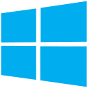

# Olá 
Meu nome é Leandro Cândido, eu sou um estudante de informática do Instituto Federal do Ceará (IFCE), atualmente no 5° semestre do ensino médio.

- 🔭 Atualmente eu estou estudando **Desenvolvimento Web**

- 💬 Meus hobbies atuais são ler **mangá** e trabalhar em ideias para projetos novos

- 🌱 Atualmente estou aprendendo **Japonês**

- ☁️ Eu me encaixo melhor em trabalhos relacionados ao **Back-End**, mas eu também consigo trabalhar como **Full Stack** quando necessário

## Habilidades Técnicas

### Linguagens de Programação

 

#

### Linguagens para Desenvolvimento Web

 

#

### Frameworks

 

#

### Sistemas Operacionais

 

#

### Editor de Texto

 

#

### IDE

 

#

### Produção de Conteúdo

 

#

### Banco de Dados

 

#

### Outros

 

<!--

#

### O que eu quero aprender

 

-->

#

## Atividade do meu perfil

## Onde também pode me encontrar

 

### Contador de visitantes

#### Leia isso em outras línguas
<kbd></kbd>
